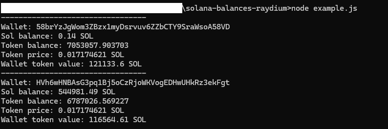

# Solana Balances Raydium

This repository provides tools and scripts for interacting with the Solana blockchain to retrieve balance information for Raydium. 
The project is set up using TypeScript and includes an example script to demonstrate its usage.

## Features

- Retrieve Solana balance for a given wallet.
- Retrieve SPL token balance for a given wallet.
- Fetch the price of a token from Raydium liquidity pools.
- Easy to use and integrate into existing projects.

## Prerequisites

Ensure you have the following installed:

- [Node.js](https://nodejs.org/) (version 14 or later)
- [npm](https://www.npmjs.com/)
- [TypeScript](https://www.typescriptlang.org/)

## Installation

To install the package, clone the repository and install the dependencies:

```bash
git clone https://github.com/bilix-software/solana-balances-raydium.git
cd solana-balances-raydium
npm install
```

## Configuration

Before running the example, you need to set up your wallet public key and specify the token and market addresses. Open the `example.ts` file and replace the placeholder values with your actual wallet public key, token mint address, and market address.

### Example Configuration

In `example.ts`, set your wallet public key, token mint address, and market address:

Replace the placeholders (`'your-public-key-here'`, `'token-public-key-here'`, `'openbook-market-public-key-here'`) with actual values before running the script.

## Usage

To compile and run the example:

1. Ensure your `example.ts` file is correctly configured.
2. Compile the TypeScript files:

```bash
npx tsc
```

3. Run the compiled JavaScript file:

```bash
node example.js
```

## Project Structure

- `src/`: Contains the source code for the package.
    - `balances.ts`: Functions to get balances and fetch token prices.
    - `types.ts`: Type definitions used in the project.
- `example.ts`: Example script to demonstrate how to use the package.
- `package.json`: Project metadata and dependencies.
- `tsconfig.json`: TypeScript configuration file.
- `image01.png`: Example output image.
- `LICENSE`: License file.

## Example Output

Below is an example of the output generated when running the script:



The variables for this example output were:
```typescript
const marketAddress = 'EzMCG3oJpXu2enNAh2A18iSg6Giq3Bt1wPDFDDiYgxeY'; // Replace with your actual token marketAddress, this example is for dogwifhat
const tokenAddress = 'EKpQGSJtjMFqKZ9KQanSqYXRcF8fBopzLHYxdM65zcjm'; //Replace with actual token mint address, this example is for dogwifhat
const wallets = [
    { publickey: '58brYzJgWom3ZBzx1myDsrvuv6ZZbCTY9SraWsoA58VD' },
    { publickey: 'HVh6wHNBAsG3pq1Bj5oCzRjoWKVogEDHwUHkRz3ekFgt' } // Replace with your actual wallets
];
```

## Contributing

Contributions are welcome! Please fork the repository and submit a pull request with your improvements.

1. Fork the repository
2. Create your feature branch (`git checkout -b feature/YourFeature`)
3. Commit your changes (`git commit -m 'Add some feature'`)
4. Push to the branch (`git push origin feature/YourFeature`)
5. Open a pull request

## License

This project is licensed under the MIT License - see the [LICENSE](LICENSE) file for details.

## Tips
JATt1ta9GcbVMThdL18rXUqHn3toCMjWkHWtxM5WN3ec

